# Smart home resources

## Diagram of home-related resources

*Right-click on nodes and open in a new tab to see the project's implementation*

```mermaid
%%{init: {"flowchart": {"htmlLabels": false}} }%%

flowchart TD
 subgraph k8s["Kubernetes"]
        Satellite["Satellite"]
        openwakeword["openwakeword"]
        External-mic["External-mic"]
        HomeAssistant(["Home Assistant"])
        LocalAI["LocalAI"]
        Piper["Piper"]
        Whisper["Whisper"]
  end
    click HomeAssistant callback "Github link for Home-Assistant"
    click HomeAssistant "https://github.com/gruberdev/homelab/tree/main/apps/home/ha" "Github app path"
    click HomeAssistant "https://github.com/gruberdev/homelab/tree/main/apps/home/ha" "Github app path"
    click External-mic "https://github.com/gruberdev/homelab/tree/main/apps/home/external-mic" "Github app path"
    click openwakeword "https://github.com/gruberdev/homelab/tree/main/apps/home/openwakeword" "Github app path"
    click Piper "https://github.com/gruberdev/homelab/tree/main/apps/home/piper" "Github app path"
    click Whisper "https://github.com/gruberdev/homelab/tree/main/apps/home/whisper" "Github app path"
    click Satellite "https://github.com/gruberdev/homelab/tree/main/apps/home/satellite" "Github app path"
    click LocalAI "https://github.com/gruberdev/homelab/tree/main/apps/services/mlops/local-ai" "Github app path"
    Host_Computer{{"Host Interface (Node)"}} -- Sending microphone audio --> External-mic
    Satellite -. Links indirectly through Wyoming protoocol .-> Whisper
    External-mic -- Relaying audio over a containerized API --> Satellite
    Satellite --> HomeAssistant & openwakeword
    openwakeword --> HomeAssistant
    LocalAI <-- OpenAI API replacement --> HomeAssistant
    HomeAssistant --> Piper
    Whisper <--> HomeAssistant
    Piper -- Transmitting generated assistant voice --> Host_Computer

  style Satellite fill:##0582ca,stroke:#333,stroke-width:2px,stroke-dasharray: 0
  style openwakeword fill:#0582ca,stroke:#333,stroke-width:2px
  style External-mic fill:#00a6fb,stroke:#333,stroke-width:2px
  style HomeAssistant fill:#051923,stroke:#333,stroke-width:3px,stroke-dasharray: 0
  style LocalAI fill:#0582ca,stroke:#333,stroke-width:2px
  style Piper fill:#00a6fb,stroke:#333,stroke-width:2px
  style Whisper fill:#0582ca,stroke:#333,stroke-width:2px
  style Host_Computer  fill:#003554,stroke:#333,stroke-width:2px
```

### AI-Related resources

- [Training a custom word to activate *openWakeWord*][oww-train-uri]

### General personal resources

- [My Samsung TV update page][samsung-update-tv]
- [How to update a Samsung TV using Tizen][tizen-page-samsung]

[tizen-page-samsung]: https://www.samsung.com/us/support/answer/ANS00062224/
[samsung-update-tv]: https://www.samsung.com/br/support/model/UN50AU8000GXZD/#tips
[oww-train-uri]: https://colab.research.google.com/drive/1q1oe2zOyZp7UsB3jJiQ1IFn8z5YfjwEb?usp=sharing#scrollTo=1cbqBebHXjFD
