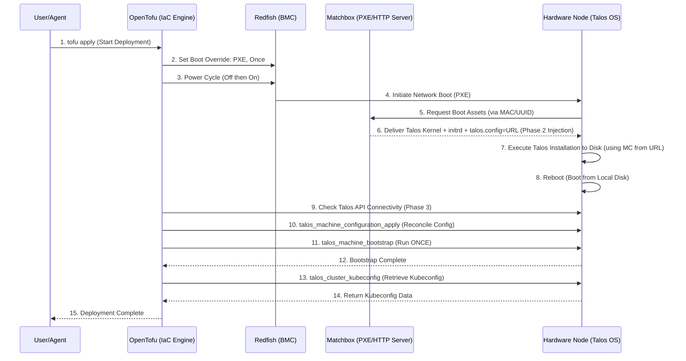

# OpenTofu Bare Metal Talos Deployment

This directory contains the OpenTofu (Terraform) configuration to provision a bare metal Talos Linux Kubernetes cluster.

## Architecture

### Flowchart: Declarative Infrastructure Pipeline

```mermaid
graph TD
    A[Start: OpenTofu apply] --> B(Phase 1: Hardware Control - Redfish Provider);
    B --> C{Set PXE Boot Override "Once"};
    C --> D{Execute Power Cycle};
    D --> E(Hardware Reboots);
    E --> F{Phase 2: OS Provisioning - Matchbox Server};
    F --> G[Matchbox Serves Talos Kernel + talos.config=URL via MAC Match];
    G --> H(Hardware Installs Talos OS to Disk);
    H --> I(Hardware Reboots from Disk);
    I --> J(Phase 3: Cluster Management - Talos Provider);
    J --> K{Apply Final Configuration State};
    K --> L{Bootstrap Kubernetes Control Plane - ONCE};
    L --> M[End: Kubeconfig Ready / Self-Managed];
```

### Sequence Diagram: OpenTofu Orchestration Chain



## Reference URLs

- [Matchbox Documentation](https://matchbox.psdn.io/)
- [OpenTofu Documentation](https://opentofu.org/docs/)
- [Talos Linux Documentation](https://www.talos.dev/)
- [Terraform Matchbox Provider](https://registry.terraform.io/providers/poseidon/matchbox/latest/docs)
- [Terraform Redfish Provider](https://registry.terraform.io/providers/dell/redfish/latest/docs)
- [Terraform Talos Provider](https://registry.terraform.io/providers/siderolabs/talos/latest/docs)
